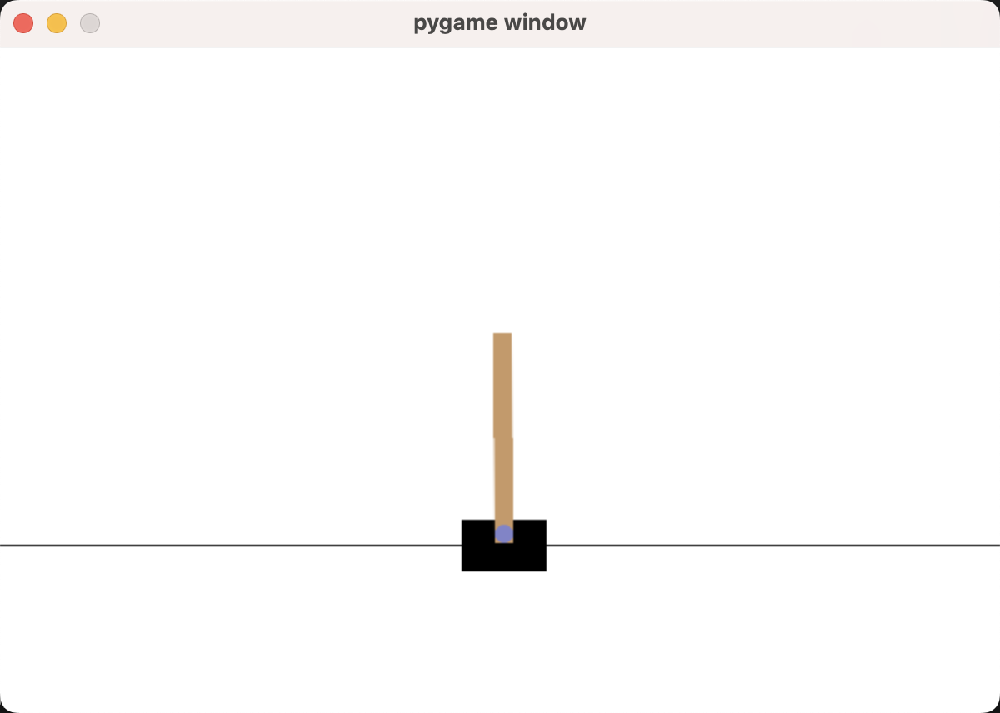
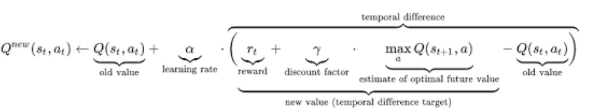

# 使用Q-Learning训练倒立摆

最近在浅浅地学习一些RL相关内容，建立本repo仅做学习记录。本人工程渣，请见谅！  
如有错误，请不吝赐教！小弟拜谢。

## 安装相关库

```zsh
conda install gym[all]
```

## 运行

先运行[`cartpole_train.py`](./cartpole_train.py)  
再运行[`cartpole_run.py`](./cartpole_run.py)

## 预期结果



## 原理

- Q-Learning

    
    [维基百科: Q-learning](https://en.wikipedia.org/wiki/Q-learning)

- gym库倒立摆相关内容

    [官方文档](https://www.gymlibrary.dev/environments/classic_control/cart_pole/)
